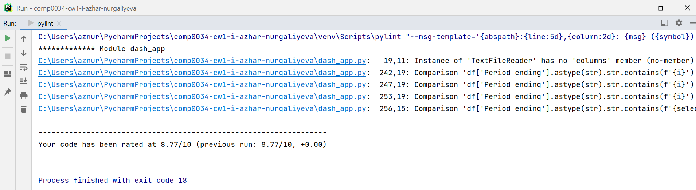

# COMP0034: Coursework 1 repository

[Repository URL](https://github.com/ucl-comp0035/comp0034-cw1-i-azhar-nurgaliyeva)

## Target audience

For all the visualisations I am using the same target audience as in
the [COMP0035: Coursework 1](https://github.com/ucl-comp0035/coursework-1-azhar-nurgaliyeva):

It is important for our target audience to have understandable, clean and relevant visualisations to answer the
questions established by the problem statement.

## Questions to be answered using the dataset

1) Is there any pattern in the changes of usage for public transportation in London?

Answered using **Line graph - "Usage of public transport by journey types in London"**

2) Which group of public transportation customers use the most?

Answered using **Pie chart - "Amount of journeys in a year"**

3) Are trends similar to the performance before the pandemic?

Answered using **Line graph - "Usage of public transport by journey types in London"** and
**Subplots - "Usage of overground, DLR, tram and TfL rail journey types in London"**

4) Is there a transport type that has performance similar to the numbers before the pandemic?

Answered using **Subplots - "Usage of overground, DLR, tram and TfL rail journey types in London"**

5) Is there any consistent pattern in the distribution of numerical data and its skewness?

Answered using **Box plots - "Statistical analysis of the quartile data"**

## Explanation and evaluation of the chosen visualisations

In the implementation of all visualisations, I mostly used Plotly Express rather than Plotly Go as it usually takes
fewer lines for the same output. However, Plotly Go was useful when creating subplots for one of the visualisations. [1]

In order to make the design of the dash app more user-friendly, I decided to use the tabs [2] to make it easier transferring
from one visualisation to another. [3] This solution is more efficient and appealing rather than making user to
scroll through all the visualisations on one page.

1. **Line graph - "Usage of public transport by journey types in London"**
    1. Target audience and question: the target audience for this visualisation are data analysts in TfL who would need to compare the usage of public
       transportation by journey types in London from January 2018 to August 2021. This visual representation is
       intended to answer the question on whether there is any pattern in the changes of usage for public transportation
       in London over the given period (January 2018 - August 2021).
    2. Explanation: the dataset represents information about amount of journeys taken during different reporting periods and
       financial years. Journeys are grouped by type of public transport. This visualisation shows all the journeys (in
       millions) for the available time period to see and analyse general trends in the usage of public transport in
       London. The user can also choose one journey type from the list to have a closer look at the amount for
       particular type of transport. When nothing is selected, the line graph with all the data is shown for overall
       trend establishment.
    3. Evaluation: the resulting visualisation is understandable and relevant for the identification of patterns in the changes of
       usage for public transport in London. We can clearly see how the trend for the usage of all transport types has
       fallen after March 2020 due to coronavirus pandemic. However, it could be improved further by being able to
       choose several types of transport on the graph for easier analysis and comparison. Another improvement can be
       introducing the range slider for the x-axis, which represents the timeline. Current line graph is good for
       establishing general trends but for deeper analysis user might want to have more control and filtering options.
2. **Bar chart - "Cumulative usage of public transport by journey types in London"**
    1. Target audience and question: the target audience for this visualisation are data analysts in TfL who would need to compare the usage of public
       transportation by journey types in London from January 2018 to August 2021. This visual representation is
       intended to answer the question on whether there are changes in the cumulative usage of public transportation in
       London over the given period (January 2018 - August 2021). This information might be needed for analysts to see
       how overall performance of Transport for London (TfL) has changed and whether they are performing on the same
       scale.
    2. Explanation: the dataset gives the information about amount of journeys taken for each type of public transport separately.
       This is why it is a bit unclear on whether cumulative numbers are the same or not. This visualisation shows
       cumulative numbers for the usage of public transport for the available time period. This allows user to see and
       analyse whether general trend has equally affected all the journey types. The bar graph is shown for overall
       trend establishment with coloured legend for each type of transport.
    3. Evaluation: the final bar chart is useful for comparing cumulative usage of transport in London over the specified period.
       User can see the overall distribution and cumulative numbers for all TfL services. However, it could be improved
       by introducing the range slider for the x-axis, which represents the timeline. Current bar chart is
       understandable for establishing general tendencies and distribution of data points but user might request to have
       better outlook by limiting the requested timeline.
3. **Pie chart - "Amount of journeys in a year"**
    1. Target audience and question: the target audience for this visualisation are data analysts in TfL who would need to compare the usage of public
       transportation by journey types in London from January 2018 to August 2021. This visual representation is
       intended to answer the question of which group of public transportation consumers use the most for a given
       timeline. This will allow analysts to understand whether preferences for transport has changed due to the
       pandemic.
    2. Explanation: the dataset gives the information about amount of journeys taken for each type of public transport for different
       reporting periods and financial years. This information can be used to compare the share of each transport type
       to the total amount of journeys. The pie chart shows how a total amount of journeys is divided between different
       types of transportation for the available time period. The user should be able to see the percentage of each
       transport category towards the total amount. The pie graph is shown for overall establishment of customers'
       preferences with coloured legend for each type of transport. Moreover, the range slider is added to analyse the
       change in percentage shares over the years.
    3. Evaluation: this visualisation is handy for identifying the most popular transport types in London and tracking the
       percentage changes in the demand of customers over the years. User can clearly see that bus journeys remain the
       most popular journey type in London before and after restrictions were being lifted. This pie chart can be
       further upgraded by making the range of values on the timeline slider smaller. User might want to compare between
       certain months of the year rather than full years.
4. **Subplots - "Usage of overground, DLR, tram and TfL rail journey types in London"**
    1. Target audience and question: the target audience for this visualisation are data analysts in TfL who would need to compare the usage of public
       transportation by journey types in London from January 2018 to August 2021. This visual representation is
       intended to answer the question on whether trends in usage are similar to the performance before the pandemic in
       London over the given period (January 2018 - August 2021) and which journey type's performance has not been
       affected much. This information is crucial for data analysts as it helps to establish strategies on how to
       improve the statistics to before the pandemic levels.
    2. Explanation: the dataset gives the information about amount of journeys taken for each type of public transport for different
       reporting periods and financial years. From the analysis of the first visualisation, Overground, DLR, tram and
       TfL Rail journey types have rebounded to almost similar performance as before the pandemic compared to bus or
       underground journeys. Emirates Airline journeys are not taken into account for this analysis as they are mostly
       used for entertainment purposes by the public. To get deeper analysis on this, it is worth plotting data for
       these transport types as subplots for better comparison. [4] The user should be able to see a separate line graph
       for each transport category (overground, tram, DLR and TfL Rail) from 2018 to 2021.
    3. Evaluation: this visualisation allows us to analyse how effectively overground, tram, DLR and TfL rail journeys have
       rebounded when restrictions were lifted compared to the performance before the pandemic. Moreover, we can see
       that TfL rail journeys have gone to approximately the same level performance as before the pandemic compared to
       all the other types of transport in London. These subplots can be improved by having flexible timelines that are
       being controlled by range slider or radio items.
5. **Box plots - "Statistical analysis of the quartile data"**
    1. Target audience and question: the target audience for this visualisation are data analysts in TfL who would need to compare the usage of public
       transportation by journey types in London from January 2018 to August 2021. This visual representation is
       intended to answer the question on whether there is any consistent pattern in the distribution of numerical data
       and its skewness over the given period (January 2018 - August 2021). Analysts require such information because
       statistical analysis is one of the most significant parts of the data analysis for the industry applications.
    2. Explanation: the dataset gives the numerical information about amount of journeys taken for each type of public transport.
       This visualisation shows the statistical representation of the numerical data through the concept of box plots.
       Box plots are used to represent data through displaying its quartiles, outliers and median values. This allows
       user to see and analyse minimum/maximum values, interquartile range (IQR), outliers and signs of skewness. [5]
       The box plots are shown for each type of transport to analyse their statistical information.
    3. Evaluation: box plots allows us to explore statistical distribution of the data and its skewness. [6] Bus journeys have the
       biggest interquartile range (IQR), which makes sense as it is the most popular transport type. Moreover, user can
       see that for all journey types (except Emirates Airline) the distribution is negatively skewed. This is because
       the median is closer to the top of the box. Emirates Airline's box plot is not particularly correct as most of
       the values have been filled to be 0.1 by TfL, when in practice the airline doesn't operate. Therefore, outliers
       provided by the box plot are not outliers in reality. These graphs can be improved by having several box plots on
       the same plane of the graph (perhaps checkboxes should be used for this instead of radio items). Another good
       addition would be to filter Emirates Airline data to remove the redundant data in order to get more accurate box
       plot.

## Pylint, recording & tracking errors using GitHub issues

Installed *pylint* [7] in order to find potential code quality issues and to address them. Unfortunately, I am not able
to demonstrate 100% absence of issues because the remaining issues are related to the way I am extracting information in
callback functions. After trying to work through them, I realised that callback on one of the visualisations stops
working. This is why I decided to leave these issues.

The final code in dash_app.py has been rated: **"Your code has been rated at 8.77/10 (previous run: 8.77/10, +0.00)".**

Some recording and tracking of bugs and errors has been done
using [GitHub issues](https://github.com/ucl-comp0035/comp0034-cw1-i-azhar-nurgaliyeva/issues?q=is%3Aissue+).

## References

[1] Graph Objects. [online] plotly.com. Available
at: https://plotly.com/python/graph-objects/#when-to-use-graph-objects-vs-plotly-express [Accessed 28 Feb. 2022].

[2] dash-bootstrap-components.opensource.faculty.ai. (n.d.). Tabs - dbc docs. [online] Available
at: https://dash-bootstrap-components.opensource.faculty.ai/docs/components/tabs/ [Accessed 28 Feb. 2022].

[3] dash.plotly.com. (n.d.). Tabs | Dash for Python Documentation | Plotly. [online] Available
at: https://dash.plotly.com/dash-core-components/tabs [Accessed 28 Feb. 2022].

[4] plotlygraphs (2019b). Subplots. [online] plotly.com. Available
at: https://plotly.com/python/subplots/ [Accessed 28 Feb. 2022].

[5] plotly.com. (n.d.). Box Plots. [online] Available at: https://plotly.com/python/box-plots/.plotlygraphs (2019a).

[6] www.simplypsychology.org. (n.d.). Box Plot | Simply Psychology. [online] Available
at: https://www.simplypsychology.org/boxplots.html#:~:text=The%20box%20plot%20shape%20will.

[7] PyCharm Help. (n.d.). External tools | PyCharm. [online] Available
at: https://www.jetbrains.com/help/pycharm/configuring-third-party-tools.html [Accessed 1 Mar. 2022].